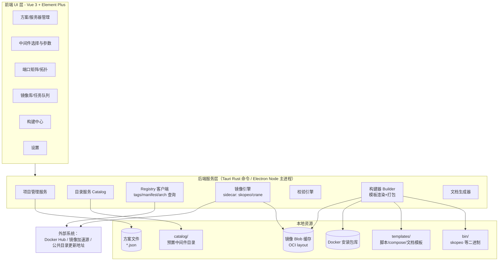
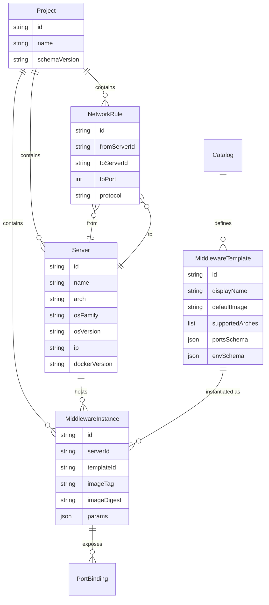

# 离线部署运维工具（OfflinePreOpsTool）方案设计

| 项目 | 内容 |
|---|---|
| 文档版本 | v1.1（修订） |
| 日期 | 2026-09-29 |
| 状态 | 待评审 |
| 项目名称 | OfflinePreOpsTool（离线部署运维工具） |
| 目标读者 | 项目决策者、开发人员、实施与运维人员 |

---

## 目录

1. [项目背景与目标](#1-项目背景与目标)
2. [总体方案](#2-总体方案)
3. [技术选型](#3-技术选型)
4. [核心数据模型](#4-核心数据模型)
5. [中间件目录（仓库）设计](#5-中间件目录仓库设计)
6. [镜像拉取与缓存设计](#6-镜像拉取与缓存设计)
7. [Docker 离线安装包管理](#7-docker-离线安装包管理)
8. [离线产物设计](#8-离线产物设计)
9. [服务器端脚本设计](#9-服务器端脚本设计)
10. [运维文档生成设计](#10-运维文档生成设计)
11. [端口矩阵与网络设计](#11-端口矩阵与网络设计)
12. [校验体系](#12-校验体系)
13. [安全设计](#13-安全设计)
14. [UI / 页面设计](#14-ui--页面设计)
15. [代码仓库结构](#15-代码仓库结构)
16. [测试策略](#16-测试策略)
17. [开发里程碑与工作量估算](#17-开发里程碑与工作量估算)
18. [风险与对策](#18-风险与对策)
19. [附录](#19-附录)

---

## 1. 项目背景与目标

### 1.1 业务背景

在政务、军工、能源等行业中，业务系统部署在**完全隔离的内网环境**（无任何外网出口）：

- 服务器无法访问公网，不能在线执行 `yum install` / `apt install` / `docker pull`；
- 服务器种类多样，且**信创化改造后 CPU 架构高度异构**：
  - `x86_64`：Intel / AMD / 海光 / 兆芯；
  - `aarch64 (arm64)`：鲲鹏 / 飞腾；
  - `loongarch64`：龙芯（新世界/旧世界）；
  - （少见）`mips64el`：旧龙芯；`sw64`：申威，Docker 支持极其有限，本期仅做识别与提示。
- 操作系统多样：银河麒麟 V10（SP1/SP2/SP3）、统信 UOS Server、openEuler、CentOS 7/8、Rocky、Ubuntu、凝思、中科方德等；
- 交付物需要**可审计、可校验、防篡改**（摆渡过程不可控）；
- 现场运维人员技术水平参差不齐，需要**一键化部署 + 标准化运维脚本 + 图文文档**。

### 1.2 现状痛点（手工做法的问题）

| 痛点 | 具体表现 |
|---|---|
| 拉镜像靠手工 | 在有网机器上人工 `docker pull` + `docker save`，容易漏镜像、**拉错 CPU 架构**（默认拉本机架构）、版本不一致 |
| 编排靠手工 | compose 文件手写、复制粘贴，端口、密码、目录各环境不一致 |
| 端口管理靠 Excel | 端口冲突到现场才暴露；防火墙开通靠口头沟通，缺少规范的《端口开通申请表》 |
| 部署无标准 | 现场安装 Docker、装载镜像、起服务的步骤因人而异，出问题无从追溯 |
| 运维无工具 | 重启某容器、看日志、备份等操作每次现查命令；文档缺失或与实际不符 |

### 1.3 工具目标

做一个**运行在（有外网的）办公机上的桌面工具**，完成"方案定义 → 镜像准备 → 离线包生成"的全流程，产出的每台服务器离线包内含：

1. **离线安装材料**：Docker 引擎离线安装包（按服务器架构/OS 匹配）+ 全部中间件镜像 tar；
2. **一键部署脚本**：首次一键部署（含环境预检、装 Docker、导镜像、起服务、健康检查）；
3. **日常运维脚本**：重启容器、看日志、备份、升级、诊断等快捷操作；
4. **运维操作文档**：与本方案强一致、自动生成的常用指令文档与端口矩阵。

### 1.4 边界（本工具不做的事）

- ❌ 不直接连接内网服务器远程执行——产物是**自包含离线包**，通过 U 盘/光盘/安全摆渡设备交付；
- ❌ 不管理业务应用的镜像构建（业务镜像可通过"本地镜像导入"能力进入离线包）；
- ❌ 不做 K8s/容器云编排——聚焦**单机 Docker Compose** 编排（政务单机/少量节点场景主流）；K8s 离线化可作为远期扩展；
- ❌ 不做内网监控平台——产物中的 `ops.sh doctor` 提供本机诊断能力即可。

---

## 2. 总体方案

### 2.1 两阶段使用模型

```text
┌─────────────────────────────────────────────────────────────────┐
│ 阶段一：外网办公机（本工具运行）                                    │
│                                                                 │
│  定义服务器清单 → 选中间件/版本/端口 → 定义服务器间访问关系          │
│        → 校验（端口/架构/资源） → 在线拉取镜像（跨架构）             │
│        → 生成每台服务器的离线包（脚本+文档+镜像+安装包）              │
└───────────────────────────┬─────────────────────────────────────┘
                            │ U盘 / 光盘 / 安全摆渡（附 SHA256）
┌───────────────────────────▼─────────────────────────────────────┐
│ 阶段二：内网服务器                                               │
│                                                                 │
│  拷贝对应压缩包 → 解压 → ./deploy.sh 一键部署                      │
│        → 日常运维：./ops.sh（菜单/子命令）+ docs/ 运维文档          │
└─────────────────────────────────────────────────────────────────┘
```

### 2.2 总体架构



要点：

- **前后端分离**：前端纯 Vue 3，后端能力以"命令接口"形式暴露；后端接口抽象为 `BackendAdapter`，Tauri 与 Electron 可互换（见 §3.1）；
- **模板外置**：`deploy.sh`、`ops.sh`、compose、文档全部是模板文件（Jinja 语法），随数据渲染生成，**改模板不需要改程序**，便于按项目定制；
- **镜像引擎无守护进程化（daemonless）**：办公机不需要安装 Docker，内嵌 `skopeo` 二进制完成跨架构拉取与导出（见 §3.2）。

### 2.3 端到端流程（用户视角）

1. 新建"部署方案"，录入 N 台服务器（架构、位数、OS、IP、资源、数据盘等）；
2. 为每台服务器从中间件目录挑选中间件（或手动输入镜像地址解析），选择版本（可查看 tag 列表与架构支持矩阵）、配置端口/密码/参数；
3. 定义服务器之间的端口访问关系（谁访问谁的哪个端口）；
4. 点击"校验"：端口冲突、架构兼容、资源估算等检查（见 §12）；
5. 点击"构建"：在线拉取镜像（跨架构、镜像源自动切换、去重缓存）→ 按服务器生成离线包并压缩 → 输出 SHA256 校验与构建报告；
6. 将各服务器对应的包 + 校验值通过摆渡介质带入场；
7. 现场解压执行 `./deploy.sh`，完成部署与自检；
8. 日常使用 `./ops.sh` 与 `docs/OPS-GUIDE.md` 运维。

---

## 3. 技术选型

### 3.1 桌面框架：推荐 Tauri 2.x（备选 Electron）

| 维度 | Tauri 2.x（推荐） | Electron |
|---|---|---|
| 安装包体积 | ~10 MB（含前端资源与 sidecar 后另计） | 90~150 MB 起步 |
| 内存占用 | 低（系统 WebView） | 高（自带 Chromium） |
| 后端语言 | Rust（子进程管理、文件/压缩/哈希性能好，单二进制可靠） | Node.js（团队更熟悉，生态成熟） |
| 调用外部二进制 | sidecar（`externalBin`）机制完善 | `child_process.spawn`，简单直接 |
| Windows/Linux 支持 | ✅（x64/arm64） | ✅ |
| WebView 兼容性风险 | 依赖系统 WebView2（Win10/11 自带；Win7 需装）；Linux 依赖 webkit2gtk（UOS/麒麟桌面版可用，但老版本可能有渲染差异 | 自带 Chromium，无此风险 |
| 自动更新 | 内置 updater | electron-updater 成熟 |

**决策：推荐 Tauri 2.x**，理由：本工具是"重后端、轻界面"的工具型应用，核心负载（拉镜像、哈希、打包）都在后端，Rust 侧性能与可靠性收益大；安装包小，便于在政务环境分发。

**风险对冲**：前端与后端之间的所有调用收敛到一个 `BackendAdapter` TypeScript 接口层（`invoke()` 封装），前端代码与桌面框架（Tauri/Electron）完全解耦。若团队 Rust 储备不足或必须兼容极老的桌面系统，可切换到 Electron 实现，前端与模板资产全部复用。

### 3.2 镜像拉取引擎（关键决策：daemonless）

办公机（多为 Windows，且未必有 Docker Desktop）需要**跨架构**拉取镜像（如办公机是 x86，目标是 arm64），对比三种方案：

| 方案 | 是否需要本机 Docker | 跨架构 | 说明 |
|---|---|---|---|
| 本地 Docker + `pull --platform` + `save` | ✅ 需要 | ✅ | 要求安装并启动 Docker Desktop，办公机负担大、启动慢 |
| **skopeo（内嵌 sidecar）** | ❌ 不需要 | ✅ | `skopeo copy docker://nginx:1.25 docker-archive:nginx.tar:nginx:1.25 --override-os linux --override-arch arm64`；支持认证、多镜像源、digest 校验 |
| crane（go-containerregistry） | ❌ 不需要 | ✅ | 单二进制，Windows 官方 release；作为备用引擎 |

**决策：内嵌 `skopeo` 为默认引擎，`crane` 为备用引擎；若检测到本机可用 Docker，也允许切换为"本机 Docker 模式"**（可复用本机已有镜像缓存）。两个二进制按平台打包进应用安装包（`bin/` 目录，Tauri sidecar 机制）。

镜像元数据查询（tag 列表、manifest 架构矩阵）不依赖 sidecar，由后端直接实现 **Registry v2 API 客户端**（含 Docker Hub 匿名 token 流程、Basic 认证），便于精细控制超时、镜像源回退与并发。

### 3.3 其余关键选型

| 项 | 选型 | 说明 |
|---|---|---|
| 前端框架 | **Vue 3 + TypeScript + Vite** | 组合式 API；Vite 冷启/热更快，契合工具型应用迭代节奏 |
| UI 组件库 | **Element Plus** | 表格/表单/树/穿梭框能力强，政务后台主流选择 |
| 原子化样式 | **Tailwind CSS** | 快速排版与自定义布局；注意与 Element Plus 共存：关闭 `preflight` 或配置 `important: ['#app']`，避免组件库样式被重置 |
| 状态管理 | Pinia | Vue 官方推荐，模块化 store |
| 拓扑图 | Vue Flow（@vue-flow/core） | 服务器端口访问拓扑可视化 |
| 模板引擎 | minijinja（Rust）/ handlebars（Node 备选实现） | 脚本、compose、文档统一模板化 |
| 压缩/归档 | tar + gzip / zip（Rust `tar`/`flate2`/`zip` crate） | 打包策略见 §8.2 |
| 数据存储 | 方案 = JSON 文件；应用配置 = 本地 JSON；凭据 = OS 凭据库（Rust `keyring` / Electron `safeStorage`） | 方案文件可 git 化、可评审 |
| 日志 | tracing（Rust）+ 前端展示 | 全操作留痕，便于排查构建问题 |

---

## 4. 核心数据模型

### 4.1 概念模型



### 4.2 各对象 Schema 与示例

#### Project（部署方案文件 `*.json`）

```jsonc
{
  "schemaVersion": 1,
  "id": "proj-20260929-0001",
  "name": "XX 政务平台一期",
  "customer": "XX 厅",
  "createdAt": "2026-09-29T10:00:00+08:00",
  "updatedAt": "2026-09-29T12:00:00+08:00",
  "buildConfig": {
    "packageFormat": "tar.gz",        // tar.gz | zip | tar | dir
    "recompressImages": false,        // 镜像 tar 是否参与二次压缩（默认否，见 §8.2）
    "sign": true                      // 是否 GPG 签名
  },
  "servers": [
    {
      "id": "srv-app-01",
      "name": "应用服务器01",
      "hostname": "app-01",
      "ip": "10.10.1.11",
      "os": { "family": "kylin", "version": "V10 SP3" },
      "arch": "amd64",                 // amd64 | arm64 | loongarch64 ...
      "bits": 64,
      "cpuCores": 8,
      "memoryGB": 32,
      "disk": { "systemGB": 100, "dataGB": 500 },
      "docker": { "version": "27.5.1", "dataRoot": "/data/docker" },
      "deployBaseDir": "/opt/stack"
    },
    {
      "id": "srv-db-01",
      "name": "数据库服务器01",
      "hostname": "db-01",
      "ip": "10.10.1.21",
      "os": { "family": "uos", "version": "Server 20" },
      "arch": "arm64",
      "bits": 64,
      "cpuCores": 16,
      "memoryGB": 64,
      "disk": { "systemGB": 100, "dataGB": 1000 },
      "docker": { "version": "27.5.1", "dataRoot": "/data/docker" },
      "deployBaseDir": "/opt/stack"
    }
  ],
  "instances": [
    {
      "id": "inst-mysql-01",
      "serverId": "srv-db-01",
      "templateId": "mysql-8.0",
      "image": "mysql:8.0.42",
      "digest": "sha256:0c7b2f...",   // 拉取后回填，锁定版本
      "instanceName": "mysql",
      "params": {
        "rootPasswordRef": "vault:mysql01-root",  // 凭据引用，见 §13
        "memoryLimitGB": 16,
        "database": "govapp",
        "appUser": "govapp",
        "dataDir": "/data/mysql"
      },
      "ports": [ { "name": "mysql", "host": 3306, "container": 3306, "protocol": "tcp", "expose": true } ]
    },
    {
      "id": "inst-redis-01",
      "serverId": "srv-app-01",
      "templateId": "redis-7",
      "image": "redis:7.2.5",
      "digest": "sha256:...",
      "instanceName": "redis",
      "params": { "passwordRef": "vault:redis01", "maxmemoryMB": 4096, "dataDir": "/data/redis" },
      "ports": [ { "name": "redis", "host": 6379, "container": 6379, "protocol": "tcp", "expose": true } ]
    }
  ],
  "networkRules": [
    {
      "id": "rule-001",
      "fromServerId": "srv-app-01",
      "toServerId": "srv-db-01",
      "toPort": 3306,
      "protocol": "tcp",
      "description": "应用访问 MySQL"
    },
    {
      "id": "rule-002",
      "fromServerId": "srv-app-01",
      "toServerId": "srv-app-01",
      "toPort": 6379,
      "protocol": "tcp",
      "description": "本机 Redis（生成规则时自动合并为本机放行）"
    }
  ]
}
```

#### MiddlewareTemplate（中间件目录条目，见 §5.2 详细字段）

```jsonc
{
  "id": "mysql-8.0",
  "displayName": "MySQL 8.0",
  "category": "数据库",
  "vendor": "Oracle(开源)",
  "defaultImage": "docker.io/library/mysql",
  "recommendedTags": ["8.0.42", "8.0.41", "8.0.40"],
  "supportedArches": ["amd64", "arm64"],
  "xinchuangNote": "信创环境优先确认镜像源提供对应架构",
  "portsSchema": [
    { "name": "mysql", "container": 3306, "defaultHost": 3306, "protocol": "tcp" }
  ],
  "envSchema": { /* JSON Schema，驱动前端动态表单 */ },
  "volumes": [
    { "name": "data", "containerPath": "/var/lib/mysql", "required": true },
    { "name": "conf", "containerPath": "/etc/mysql/conf.d", "required": false }
  ],
  "sysctls": {},
  "healthCheck": { "type": "exec", "cmd": ["mysqladmin", "ping", "-h", "127.0.0.1"], "timeoutSec": 300 },
  "backupStrategy": { "type": "mysqldump", "cmd": "mysqldump --all-databases --single-transaction" },
  "composeTemplate": "compose/mysql.yml.j2",
  "opsDoc": "docs-snippets/mysql.md.j2"
}
```

#### 产物 manifest（随每台服务器包交付，见 §8.1）

```jsonc
{
  "buildId": "b-20260929-120001-a1b2c3",
  "project": { "id": "proj-...", "name": "XX 政务平台一期", "version": "v1.0" },
  "server": { "id": "srv-db-01", "name": "数据库服务器01", "arch": "arm64", "os": "uos-20" },
  "docker": { "version": "27.5.1", "packageRef": "docker-27.5.1-arm64-uos" },
  "images": [
    { "reference": "docker.io/library/mysql:8.0.42", "digest": "sha256:0c7b...", "platform": "linux/arm64", "file": "images/mysql_8.0.42_arm64.tar", "sha256": "e3b0c4..." }
  ],
  "instances": [ /* 渲染后的实例与端口摘要 */ ],
  "firewall": { "rules": 3, "source": "networkRules" },
  "checksumsFile": "SHA256SUMS"
}
```

### 4.3 方案文件存储与版本迁移

- 路径：默认 `%APPDATA%/OfflinePreOpsTool/projects/<projectId>/project.json`（含资源附件目录 `attachments/`）；存储位置随"存储路径设置"整体迁移（见 §6.1）；
- 支持导出/导入单个 `.oppjson`（方案 + 引用的本地镜像索引 + Docker 安装包清单），供团队评审与移交；
- `schemaVersion` + 内置迁移函数链（v1→v2→…），保证旧方案文件在新版本工具中可打开；
- 所有写操作生成 `.bak` 与操作审计日志（谁/何时/改了什么字段级别可选）。

---

## 5. 中间件目录（仓库）设计

### 5.1 目录来源与更新（公共地址，免维护）

采用"**内置 + 远端目录更新**"双层结构：

1. **内置目录**：`catalog/preset.json` 随应用一起发布，保证零配置开箱可用；
2. **远端目录**（推荐启用）：目录文件托管在公共可访问地址（GitHub 仓库 / 公司公网 GitLab / 静态文件服务器），应用启动或手动触发检查更新：

```text
https://example.com/offlinepreops/catalog/latest/catalog.json     # 目录索引（含 version、updatedAt、sha256）
https://example.com/offlinepreops/catalog/v12/templates/*.json    # 各中间件模板
```

- 目录带 `version` 与整体 `sha256`，更新走"下载到临时目录 → 校验 → 原子替换"，失败自动回退；
- 这样**中间件模板（新增中间件、调整推荐版本、修复模板 bug）可不发版应用而独立演进**，实现"公共地址直接拉取、免后续维护"的诉求；
- 目录来源地址可在设置中配置多个（公司源优先，公共源兜底）。

### 5.2 模板字段定义（完整）

| 字段 | 类型 | 说明 |
|---|---|---|
| `id` | string | 全局唯一，如 `mysql-8.0` |
| `displayName` / `category` / `vendor` | string | 展示与分类（数据库/缓存/消息/网关/观测/信创…） |
| `defaultImage` | string | 默认镜像完整引用（不含 tag） |
| `recommendedTags` | string[] | 推荐版本（目录维护，可标注 stable） |
| `supportedArches` | string[] | 已知支持的架构（仍会以实际 manifest 查询结果为准） |
| `xinchuangNote` | string | 信创适配提示（如 loongarch64 需换源） |
| `portsSchema` | array | 端口定义：名称/容器端口/默认宿主端口/协议/是否默认暴露 |
| `envSchema` | JSON Schema | 驱动前端**动态参数表单**（类型/默认值/校验/分组/敏感标记） |
| `volumes` | array | 数据/配置卷及是否必填 |
| `sysctls` / `ulimits` / `kernelReqs` | object | 内核参数要求（如 ES 的 `vm.max_map_count`），驱动 precheck |
| `healthCheck` | object | 健康检查方式（exec/cmd/http/tcp）与超时，驱动 deploy 后自检与 ops doctor |
| `backupStrategy` | object | 备份方式（mysqldump/pg_dump/BGSAVE/文件快照…），驱动 ops backup |
| `composeTemplate` | string | compose 片段模板路径（Jinja2） |
| `confTemplates` | array | 需渲染的配置文件（如 redis.conf、my.cnf、nginx.conf、server.xml） |
| `opsDoc` | string | 该中间件的运维文档片段模板（拼入 OPS-GUIDE.md） |
| `minMemoryGB` | number | 最低内存要求，参与资源校验 |

### 5.3 手动输入与解析（自定义镜像）

输入框支持标准 Registry 引用语法：

```text
nginx                              → docker.io/library/nginx:latest
nginx:1.25.3                       → docker.io/library/nginx:1.25.3
quay.io/prometheus/prometheus:v2.53.0
registry.example.cn/gov/app-portal:2.3.1
mysql:8.0.42@sha256:0c7b2f...      → digest 锁定（推荐，构建产物强一致）
```

解析规则（正则，Docker 规范）：

- 含 `.`/`:`/`/` 首段视为 registry，否则默认 `docker.io`；
- 无 registry 前缀时 repo 补 `library/`；
- tag 缺省为 `latest`（UI 给出醒目警告：不建议 latest）；
- `@sha256:` 优先级高于 tag。

解析成功后自动展示：镜像摘要、架构支持矩阵（amd64 / arm64 / loongarch64 …）、体积估算、最近推送时间，用户确认后"加入清单"。

### 5.4 版本（tag）与架构查询

- 输入镜像名 → 调 Registry v2 API `GET /v2/<name>/tags/list`（分页拉全），tag 列表按语义版本排序展示，标记 `recommendedTags`；
- 选中 tag → 取 manifest（`Accept` 含 manifest list / index），解析出各平台（os/arch/variant）条目，渲染**架构支持矩阵**；
- 与目标服务器架构比对：不支持时**红色阻断**（该实例不可分配到该服务器）或提示换源；
- 查询结果本地缓存（TTL 可配），重复选择不重复请求。

### 5.5 镜像源（mirrors）与凭据

内置常见公共镜像源（可在设置中增删、排序、测速）：

| 源 | 地址 | 说明 |
|---|---|---|
| Docker Hub | `docker.io` | 官方源，可能限速 |
| DaoCloud 镜像 | `docker.m.daocloud.io` | 公共加速 |
| 1ms 镜像 | `docker.1ms.run` | 公共加速 |
| 自定义 | 任意 | 私有 harbor / 公司源，支持账号密码（存 OS 凭据库） |

拉取时按序尝试，失败自动切换下一源并记录；digest 引用可保证换源后内容一致（推荐锁定 digest 的原因之一）。

### 5.6 本地镜像导入（重要补充）

支持把**已经在别处 `docker save` 好的 tar**直接导入镜像缓存：

- `skopeo inspect docker-archive:xxx.tar` 读取元数据（引用、架构、digest）；
- 导入后与在线拉取的镜像同等待遇（分配到服务器、进产物）；
- 典型场景：客户提供私有镜像、内网已有镜像拷出、业务应用镜像。

---

## 6. 镜像拉取与缓存设计

### 6.1 存储布局与路径配置（关键需求：所有大文件路径可自定义，避免写满系统盘）

工具的落盘位置拆分为 5 个"存储根"，**全部可在设置中单独配置**，默认值仅作开箱兜底（Windows 默认在 `%APPDATA%`，首次启动向导会引导改到数据盘）：

| 存储根 | 默认路径（Windows） | 内容 | 体积特征 |
|---|---|---|---|
| `projectsRoot` | `%APPDATA%\OfflinePreOpsTool\projects` | 方案文件（JSON，KB 级） | 小 |
| `imageCacheRoot` | `%APPDATA%\OfflinePreOpsTool\cache` | 镜像 blob 缓存（结构见下） | **大（数十 GB 常见）** |
| `dockerPkgRoot` | `<imageCacheRoot>\docker-pkgs` | Docker 离线安装包库（§7） | 大（GB 级/版本） |
| `artifactRoot` | `文档\OfflinePreOpsTool\dist` | 构建产物输出目录（§8） | **大（≥ 镜像总体积）** |
| `logRoot` | `%APPDATA%\OfflinePreOpsTool\logs` | 应用与构建日志 | 中 |

配套机制：

- **首次启动向导**：检测系统盘剩余空间，引导把 `imageCacheRoot` / `dockerPkgRoot` / `artifactRoot` 设置到数据盘（如 `D:\OfflinePreOpsTool-data\...`）；
- **一键迁移**：设置页"更换目录"→ 选择新位置 → 工具搬移现有数据 → 原子更新配置并做完整性校验（失败自动回退，不出现"搬一半"状态）；也支持"只改配置不搬数据"（已有目录就地接管）；
- **写入前检查**：选择/迁移目录时校验可写性与剩余空间（对照 R11 预估体积），不达标红色警告；
- **按方案隔离产物**：`artifactRoot/<项目名>/<buildId>/`；构建页支持为单次构建**临时指定输出位置**（如直接输出到 exFAT 移动硬盘/U 盘）；
- 路径配置存于本机应用配置（不随方案文件走），机器级生效；多磁盘时建议镜像缓存与产物输出分盘，减少同盘读写竞争。

镜像缓存内部结构（blob 级去重）：

```text
<imageCacheRoot>/
├── blobs/                          # 内容寻址 blob 缓存（OCI layout）
│   └── sha256/<digest>             # 层/配置/manifest 统一存
├── refs/
│   └── <hash-of-reference>.json    # 引用 → manifest/digest/平台 映射
└── docker-pkgs/                    # Docker 离线安装包库（见 §7，可拆分为独立 dockerPkgRoot）
```

- **同一镜像多服务器复用**：blob 只存一份；导出 `docker-archive` 时按服务器分别生成 tar（每包自包含）；
- **同一 tag 多架构**：层大量重叠，增量拉取；
- 缓存支持一键清理（LRU 统计、按项目保留）。

### 6.2 拉取任务模型

- 任务队列（并发数可配，默认 3），单任务 = 一个 `(reference, platform)`；
- 每任务状态机：`解析 → 查询manifest → 架构校验 → 逐层下载（断点续传/206） → 导出 tar → sha256 复核`；
- 失败处理：镜像源自动切换、指数退避重试（3 次）、任务可单独重跑；全部任务结束输出汇总（成功/失败/体积/耗时）；
- 大文件（>5GB 层）流式落盘，实时进度（字节数/百分比/速度）上报前端。

### 6.3 导出与一致性

- 导出命令（skopeo 语义）：`skopeo copy docker://<ref> docker-archive:images/<name>_<tag>_<arch>.tar:<ref> --override-os linux --override-arch <arch>`；
- 产物内镜像清单记录 `(reference, digest, platform, tar sha256)`，`deploy.sh` 装载后以 `docker images --digests` 比对 digest，**确保装的确实是方案评审时确认的那一份**；
- 支持把 digest 固化回方案文件（"锁定版本"按钮）：评审 → 锁定 → 构建，全链路一致。

---

## 7. Docker 离线安装包管理

### 7.1 安装包来源

| 来源 | 覆盖 | 说明 |
|---|---|---|
| Docker 官方静态包 | x86_64、aarch64 | `https://download.docker.com/linux/static/stable/<arch>/docker-<ver>.tgz`，公共地址可直接下载；跨发行版通用；需工具生成 systemd unit |
| 发行版软件包（rpm/deb） | 视发行版 | 在线机上 `yum install --downloadonly --downloaddir=...` / `apt-get download` 批量下载后导入工具；信创 OS（麒麟/UOS）推荐此路，兼容性最好 |
| 信创厂商源 | loongarch64 等 | 龙芯等架构无官方静态包，使用厂商源（Loongnix、openEuler、麒麟仓库）的 docker-engine 包，由实施人员下载后导入 |
| 用户手动导入 | 全部 | "安装包库"页面选择目录/压缩包导入，自动识别（包元数据/文件名）arch、OS 族、版本 |

### 7.2 安装包库（应用内管理）

```text
<dockerPkgRoot>/<arch>/<osFamily>/<dockerVersion>/    # 默认在镜像缓存目录下，可独立配置（§6.1）
├── meta.json          # 来源、适用 OS 族列表、包类型(static|rpm|deb)
├── packages/          # rpm/deb/tgz 原始包
└── install-docker.sh  # 该包配套的安装脚本（模板渲染生成）
```

- 构建"服务器 → 安装包"匹配规则：`arch` 精确匹配 + `osFamily` 匹配（未命中则提示选择/导入）；
- 同一安装包多服务器复用（拷贝进各服务器包目录）；
- 应用可在线一键下载官方静态包（公共地址，免手工），并附带下载 **docker compose v2 插件**（GitHub releases，按 arch）一并打入每台服务器包。

### 7.3 install-docker.sh 逻辑（渲染生成，随服务器包交付）

1. 检测 root；
2. 检测已安装 Docker：版本一致 → 跳过；版本不一致 → 提示（不自动覆盖，人工确认参数）；
3. 按包类型安装：
   - rpm：`yum/dnf localinstall *.rpm --disablerepo=*`（麒麟/UOS/CentOS 系）；
   - deb：`dpkg -i *.deb && apt-get install -f --no-download`（Ubuntu/Deepin 系）；
   - static：解压到 `/usr/bin` + 写入 systemd unit（docker.service + docker.socket）；
4. 安装 compose 插件到 `/usr/local/lib/docker/cli-plugins/`；
5. 写 `/etc/docker/daemon.json`：`data-root`、日志轮转（`max-size=100m, max-file=3`）、`insecure-registries`（可选）、`registry-mirrors`（离线无用，留空）；
6. `systemctl enable --now docker`，自检 `docker info` / `docker compose version`；
7. 内核与存储驱动检查：overlay2 可用性、cgroup 状态；不满足输出详细处置指引（precheck 也提前检查）。

---

## 8. 离线产物设计

### 8.1 单台服务器产物目录结构

```text
<artifactRoot>/<项目名>/<buildId>/       # 产物输出根目录可在设置中配置（§6.1），构建页亦可临时指定
├── srv-app-01_amd64/                       # 目录名：<服务器名>_<架构>，一目了然
│   ├── manifest.json                       # 本包清单（镜像/端口/实例摘要，见 §4.2）
│   ├── SHA256SUMS                          # 全包文件校验和（deploy 前可整包校验）
│   ├── README.md                           # 《部署指引》：摆渡→解压→precheck→deploy→验证 全流程图文
│   ├── docker-offline/                     # Docker 引擎 + compose 插件离线安装（§7）
│   │   ├── packages/
│   │   └── install-docker.sh
│   ├── images/                             # docker save 格式镜像 tar（按架构拉取）
│   │   ├── nginx_1.25.3_amd64.tar
│   │   ├── redis_7.2.5_amd64.tar
│   │   └── gov-app-portal_2.3.1_amd64.tar
│   ├── stack/                              # 部署编排（compose + 配置）
│   │   ├── docker-compose.yml              # 本机全部实例统一编排
│   │   ├── .env                            # 密码/参数（权限 600，见 §13）
│   │   └── conf/
│   │       ├── nginx/nginx.conf
│   │       ├── redis/redis.conf
│   │       └── mysql/my.cnf
│   ├── scripts/
│   │   ├── precheck.sh                     # 环境预检（可独立先跑）
│   │   ├── deploy.sh                       # 一键部署（幂等，可重复执行）
│   │   ├── ops.sh                          # 日常运维（菜单+子命令，§9.3）
│   │   ├── backup.sh                       # 备份入口（ops backup 同源）
│   │   ├── restore.sh                      # 恢复
│   │   ├── upgrade.sh                      # 镜像升级（新 tar → load → 滚动重建）
│   │   ├── rollback.sh                     # 回滚上一版本
│   │   └── apply-firewall.sh               # 按端口矩阵生成防火墙规则
│   ├── firewall/
│   │   └── rules.md                        # 本机需开通端口说明（含申请表引用）
│   └── docs/
│       ├── OPS-GUIDE.md                    # 运维常用操作指令文档（§10）
│       └── PORT-MATRIX.md                  # 端口矩阵（md 版；工具端另导出 xlsx）
├── srv-db-01_arm64/                        # 其它服务器各一目录
├── PORT-MATRIX.xlsx                        # 全网端口矩阵/开通申请表（网络组用）
├── build-report.md                         # 构建报告（§8.3 第 11 步）
└── SHA256SUMS.all                          # 全部压缩包的总校验
```

> 设计取舍说明：每台服务器包**自包含**（不依赖公共目录），现场操作简单、不易出错；代价是相同镜像在多包中重复存在，工具侧通过 blob 缓存避免重复下载，并可选"公共镜像共享包"模式（`common-images.tar` 单独摆渡一次，deploy.sh 支持多路径装载）以减小总体积。

### 8.2 打包与压缩策略（重要细节）

- `docker save` 导出的 tar 内各层**已经是 gzip 压缩流**，再对整包做 gzip/zip 压缩收益通常 <5%，却显著拉长构建时间；
- 因此默认策略：**目录内除 `images/` 外的内容压缩，`images/*.tar` 以 store（仅存储）方式并入**，兼顾"单文件交付"与构建速度；
- 提供配置项：

| 配置 | 取值 | 效果 |
|---|---|---|
| `packageFormat` | `tar.gz` / `zip` / `tar` / `dir` | 默认 `tar.gz`（政务现场熟悉、Linux 原生支持） |
| `recompressImages` | `true/false` | 默认 `false`；`true` 时镜像也参与压缩（磁盘紧张时用，gzip -1） |

- **可执行权限**：tar 保留权限位；zip 不保留 → 无论何种格式，README 与所有文档统一引导用 `bash deploy.sh` 方式执行，不依赖 `+x`；
- 文本文件统一 **UTF-8（无 BOM）+ LF** 行尾，避免 Windows 摆渡后 `\r` 问题；
- 提示交付介质格式：**FAT32 U 盘单文件 4GB 上限**，镜像 tar 常超限 → 文档明确要求使用 exFAT/NTFS U 盘，或开启分卷（`split`，deploy.sh 自动识别 `*.tar.part-*` 合并）。

### 8.3 构建管线（Builder 流水线）

1. **汇总**：遍历方案，产出每服务器"应装镜像集合 / 实例参数 / 防火墙规则"；
2. **校验**：执行 §12 全部规则，错误阻断；
3. **镜像就绪**：缓存未命中的进入拉取队列（§6），全部完成或失败中止并报告；
4. **导出镜像**：按服务器导出 `images/*.tar` 并计算 sha256；
5. **匹配 Docker 安装包**：arch/OS 匹配安装包库，缺失则阻断并给出导入指引；
6. **渲染 stack/**：compose、.env、conf 由模板 + 实例参数渲染；`.env` 权限 600；
7. **渲染 scripts/**：deploy/ops/precheck/backup/restore/upgrade/rollback/apply-firewall；
8. **渲染 docs/**：README、OPS-GUIDE、PORT-MATRIX；
9. **生成 manifest.json + SHA256SUMS**；
10. **打包**：按 §8.2 策略输出 `<server>_<arch>.tar.gz` 等；
11. **构建报告** `build-report.md`：构建时间、耗时、各包体积、镜像清单（含 digest）、警告清单、目标服务器清单；总体 `SHA256SUMS.all`；（可选）GPG 签名 `.sig`；
12. 构建过程全程日志落盘，失败可从任意步骤断点重试（镜像缓存天然断点）。

### 8.4 完整性与签名

- 每文件 sha256 + 总 `SHA256SUMS.all`：摆渡后现场先校验（`sha256sum -c`）再部署，防介质损坏与篡改；
- 可选 **GPG 签名**（工具内置密钥管理，或对接公司签名规范）：`manifest.json.sig`；`deploy.sh --verify` 验签通过才继续（政务审计友好，默认关闭，按项目开启）。

---

## 9. 服务器端脚本设计

> 全部脚本由模板渲染生成；`set -euo pipefail`；兼容 bash 4.x（CentOS7/麒麟默认 bash 满足）；输出统一带颜色与日志前缀；所有操作追加审计日志 `logs/audit.log`（时间/命令/结果）。

### 9.1 precheck.sh（环境预检，可独立先行）

| 检查项 | 方法 | 级别 |
|---|---|---|
| root 权限 | `id -u` | ❌ 阻断 |
| CPU 架构匹配 | `uname -m` ↔ manifest（x86_64↔amd64, aarch64↔arm64, loongarch64↔loongarch64） | ❌ 阻断（拿错包最常见的坑） |
| OS 族匹配 | `/etc/os-release` | ⚠️ 警告 |
| 磁盘空间 | 数据盘/系统盘 vs 镜像解压+数据增长估算 | ❌/⚠️ |
| 内存 | free vs 实例限额总和 | ⚠️ |
| 端口占用 | `ss -lntup` 对照本机端口清单 | ❌（被占） |
| 内核参数 | `vm.max_map_count`(ES)、`net.core.somaxconn`、`fs.file-max` 等（由模板 `kernelReqs` 驱动） | ⚠️ 并给出 `sysctl -w` 修正命令 |
| 时间 | `date`（证书类中间件敏感） | ⚠️ |
| SELinux / 防火墙状态 | `getenforce` / `systemctl is-active firewalld` | 提示 |
| 已装 Docker | 版本对比 | 提示/❌ |
| 外网 | 确认无法访问（信息项，防止误在内网外执行敏感部署） | ℹ️ |

输出：终端 ✅/⚠️/❌ 汇总表 + `precheck-report.txt`；`--strict` 模式任何 ❌ 即退出非零（供自动化）。

### 9.2 deploy.sh（一键部署）

```bash
./deploy.sh                 # 完整部署（幂等，可重复执行）
./deploy.sh --dry-run       # 只演练打印步骤
./deploy.sh --step precheck # 分步：precheck|docker|images|stack|firewall|health|report
./deploy.sh --verify        # 先做整包 SHA256 / 签名校验
./deploy.sh --yes           # 免确认（谨慎使用）
```

流程（伪代码）：

```text
main:
  log → logs/deploy-YYYYmmdd-HHMMSS.log（tee）
  banner: 包信息（buildId / 服务器 / 架构 / 镜像数）
  [可选] --verify: sha256sum -c SHA256SUMS；GPG 验签
  1. precheck --strict（失败给出报告路径并中止）
  2. install-docker.sh（已装且版本一致则跳过）
  3. 镜像装载: docker load -i images/*.tar
       逐个 load，docker images --digests 比对 manifest 中 digest
       缺失/不一致 → ❌ 中止（防镜像被替换）
  4. stack 校验: docker compose config --quiet
  5. 启动: docker compose up -d
  6. 健康检查: 按实例 healthCheck 轮询（间隔 5s，超时=模板配置）
       失败 → 打印 docker logs <name> --tail 100，标记 FAILED 继续/中止（参数可选）
  7. [提示] 防火墙: 提示运行 apply-firewall.sh（默认不自动改防火墙）
  8. 报告: deploy-report.txt（各容器状态/端口/健康/耗时）
  9. 收尾提示: ops.sh 用法 + 文档位置 + 首次登录改密提醒
```

要点：**幂等**（重复执行安全：load 已存在镜像为 no-op，compose up 只重建变更）；**可审计**（完整日志与报告）；**失败可诊断**（每步失败都指到具体日志）。

### 9.3 ops.sh（日常运维）

双形态：无参数进入**交互菜单**；带参数作为**子命令**（可脚本化/被监控调用）。

```text
用法: ops.sh <子命令> [参数]

  status              所有服务状态总览（容器/端口/健康/运行时长）
  ps                  docker compose ps
  start|stop|restart  <name|all>    启/停/重启（all 支持依赖顺序）
  logs                <name> [-f] [--tail N]   查看日志（-f 跟随）
  exec                <name> [cmd...]          进入容器/执行命令
  stats               资源占用（CPU/内存/网络）
  top                 容器内进程
  backup              [name]  按中间件策略备份（见下）到 /data/backup/YYYYmmdd/
  restore             <备份目录> [name]         恢复
  upgrade             <新镜像tar路径|目录>      装载新镜像并滚动重建变更容器
  rollback            回滚到上一版本（compose+镜像历史）
  doctor              全面诊断：容器/端口监听/磁盘/内存/日志错误关键字/健康探活
  firewall            重新应用端口矩阵防火墙规则
  prune               清理悬空镜像/构建缓存（确认后）
  config              显示当前 stack 关键配置（密码打码）
  version             本包版本（buildId）
  help                帮助
```

交互菜单为上述能力的数字菜单（纯 `read` 实现，**不依赖 whiptail/dialog**，信创环境零依赖）。

`backup` 按中间件类型定制（由模板 `backupStrategy` 驱动）：

| 中间件 | 备份方式 |
|---|---|
| MySQL | `mysqldump --single-transaction --all-databases` → gzip |
| PostgreSQL | `pg_dumpall` → gzip |
| Redis | `BGSAVE` 后复制 `dump.rdb`（校验 last_save_time） |
| MongoDB | `mongodump` |
| MinIO | `mc mirror` 到本地备份盘 |
| ES | snapshot API（仓库指向挂载目录） |
| 其它/通用 | 停写窗口 + volume 目录 `tar`（保守方案） |

备份文件统一 `备份目录/中间件名/时间戳/`，附 `backup-manifest.txt`（内容+sha256），`restore` 依据其校验后恢复。

### 9.4 upgrade.sh（升级）

```text
输入: 新 images 目录或 tar（可由新一轮工具产物只勾选"仅镜像"生成）
1. 校验并 docker load 新镜像
2. 记录当前状态快照（compose 文件 + images digest 列表 → history/）
3. 替换 compose 中镜像引用 → docker compose up -d（只重建变更服务）
4. 健康检查；失败自动提示 rollback（一键）
5. 保留最近 N 次历史（默认 3）
```

### 9.5 rollback.sh

基于 `history/` 快照恢复 compose + 重新 `docker compose up -d`；镜像 tar 在本机已缓存（不删旧镜像的前提下可回退），文档明确"清理旧镜像前确认不需要回滚"。

### 9.6 apply-firewall.sh

- 优先 **firewalld**（zone + rich rules，按端口矩阵渲染：`firewall-cmd --permanent --add-rich-rule='rule family=ipv4 source address=10.10.1.11 port port=3306 protocol=tcp accept'`）；
- 无 firewalld 退化 **iptables**（渲染等价规则 + 持久化提示）；
- 若检测到环境策略是"上层统一管控端口"：脚本只打印《端口开通申请表》路径不动防火墙（政务常见，避免背锅），此行为在方案构建时可配置。

---

## 10. 运维文档生成设计（docs/OPS-GUIDE.md）

由工具按方案数据渲染生成，**文档与配置强一致**（端口、容器名、密码策略均来自同一份数据源，杜绝文档过期）：

```text
OPS-GUIDE.md 目录结构
├── 1. 部署架构说明
│     本机装了哪些中间件（表格：容器名/镜像/版本/端口/数据目录/健康检查）
│     目录布局（/opt/stack、/data/*、备份目录）
├── 2. 日常巡检清单（频率 + 命令，可直接复制）
│     ops.sh status / df -h / docker stats / 日志错误关键字
├── 3. 常用运维操作（每中间件一节，由模板 opsDoc 拼装）
│     MySQL: 登录/建库授权/慢日志/备份恢复/主从(如适用)
│     Redis: 登录/内存分析/大key/清缓存(危险操作警示)
│     Nginx: 配置检查/ reload / 日志切割
│     Kafka/ES/MinIO/... 同理
├── 4. 通用 Docker 操作速查
│     ps/logs/exec/restart/inspect/资源清理
├── 5. 故障排查对照表（症状 → 排查命令 → 常见原因 → 处置）
│     容器反复重启/端口起不来/磁盘满/内存不足/健康检查失败/时间漂移
├── 6. 备份与恢复（本环境策略、保留策略、演练步骤）
├── 7. 升级与回滚（配合 upgrade.sh / rollback.sh）
├── 8. 安全注意事项（密码管理、危险命令红线）
└── 9. 变更记录表 / 应急联系表（留空待现场填写）
```

另生成：`README.md`（部署指引，面向首次实施）、`PORT-MATRIX.md`（本机版）+ 工具侧导出的 `PORT-MATRIX.xlsx`（全网版 + 防火墙开通申请页签，可直接发网络组）。

---

## 11. 端口矩阵与网络设计

### 11.1 模型

- 端口来源：中间件实例的 `ports[]`（是否对外暴露可勾选；仅容器网络内部使用的端口可标记 `expose:false` 不进防火墙）；
- 访问关系 `NetworkRule(fromServer, toServer, toPort, protocol)`：来源精确到服务器（也可标记"任意/办公网段"，供管理面访问）；
- 支持从规则**反查缺口**：规则指向的端口未在任何实例暴露 → 校验错误（R9）。

### 11.2 输出物

| 输出 | 内容 | 受众 |
|---|---|---|
| UI 端口矩阵页 | 行=目标服务器:端口，列=来源服务器，单元格 ✓ | 方案设计者 |
| 拓扑图（Vue Flow） | 服务器节点 + 有向边标注端口/协议，导出 PNG | 方案评审 |
| `PORT-MATRIX.xlsx` | 全网矩阵 + 机型/架构列 + **防火墙开通申请表**（源地址/目标地址/端口/协议/用途/申请人） | 网络组 |
| `apply-firewall.sh` | 每台服务器各自的本机放行规则 | 现场 |
| `docs/PORT-MATRIX.md` | 本机视角端口表（监听地址/端口/协议/用途/放行来源） | 现场运维 |

---

## 12. 校验体系（构建前强制门禁）

| 编号 | 规则 | 级别 |
|---|---|---|
| R1 | 服务器名称/hostname/IP 重复 | ❌ |
| R2 | 同一服务器宿主端口冲突（含与 Docker 保留端口） | ❌ |
| R3 | 镜像在 Registry 上**不存在该服务器架构**的构建 | ❌（提示换 tag/源） |
| R4 | 实例内存限额之和 > 服务器内存 × 90% | ⚠️ |
| R5 | 数据盘容量 < 镜像解压体积 ×2 + 预估数据量（参数可配） | ⚠️ |
| R6 | 使用 `latest` tag | ⚠️（建议锁定具体版本/digest） |
| R7 | 必填参数缺失（envSchema required） | ❌ |
| R8 | 密码强度不足/使用默认密码 | ⚠️ |
| R9 | 访问规则目标端口未暴露 | ❌ |
| R10 | Docker 安装包库缺少该 (arch, osFamily) 组合 | ❌（阻断构建，指引导入） |
| R11 | 磁盘剩余空间 < 预估产物体积 | ❌（本机构建前） |
| R12 | loongarch64 等特殊架构且模板带信创提示 | ℹ️ 展示提示 |
| R13 | compose 渲染语法校验（`docker compose config` 若本机可用 / 纯语法校验器） | ❌ |

校验结果在 UI 集中展示（错误必须全部解决才允许构建），并写入构建报告归档。

---

## 13. 安全设计

| 主题 | 方案 |
|---|---|
| Registry 凭据 | 存 OS 凭据库（Windows Credential Manager / Linux keyring），不入方案文件 |
| 中间件密码 | 方案中仅存**引用**；构建时可①工具生成强随机密码写入 `.env`（600 权限）②占位符留待现场首启设置；OPS-GUIDE 与 `ops.sh config` 中密码**打码**显示；deploy 收尾提醒首次改密 |
| 产物完整性 | 文件级 sha256（SHA256SUMS）+ 包级总校验 + manifest digest 比对（防摆渡篡改/损坏） |
| 签名（可选） | GPG 签名 manifest，`deploy.sh --verify` 验签前置 |
| 镜像安全（可选增强） | 构建时在线侧调用 trivy 扫描，报告随包交付（`docs/SECURITY-SCAN.txt`） |
| 审计 | 工具侧构建日志/操作日志；服务器侧 scripts 全部操作写 `logs/audit.log` |
| 敏感数据 | 构建报告/文档默认不含明文密码；日志脱敏开关 |

---

## 14. UI / 页面设计

### 14.1 信息架构（左侧导航）

```text
工作台（最近方案、快速开始向导、公告/目录更新提示）
方案管理（列表、导入导出、复制、归档）
方案编辑
  ├─ 服务器清单
  ├─ 中间件编排（按服务器分组 / 按中间件分组两种视图）
  ├─ 端口矩阵与拓扑
  ├─ 校验结果
  └─ 构建中心（配置→执行→报告）
镜像库（缓存管理、拉取任务、本地导入）
Docker 安装包库（导入、下载、匹配状态）
设置（镜像源与凭据、存储路径管理（§6.1，含一键迁移）、打包策略、签名、目录源）
```

### 14.2 关键页面线框（示意）

**方案编辑 - 中间件编排**：

```text
┌─────────────┬──────────────────────────────────────────────┬─────────────┐
│ 服务器       │  srv-db-01 (arm64 / 麒麟V10)                  │ 校验面板     │
│ ▸ srv-app-01│  ┌────────────────────────────────────────┐  │ ✅ R1..R7   │
│ ▾ srv-db-01 │  │ mysql:8.0.42  [锁定digest✓]  3306/tcp  │  │ ⚠️ R4 内存  │
│   ├ mysql   │  │ redis…                                   │  │ ❌ R10 缺   │
│   └ …       │  │ [+ 添加中间件] [手动输入镜像]              │  │   arm64安装 │
│             │  └────────────────────────────────────────┘  │   包        │
└─────────────┴──────────────────────────────────────────────┴─────────────┘
```

**中间件选择器（目录浏览 + 手动解析二合一）**：

```text
┌─ 添加中间件到 srv-db-01 ──────────────────────────────────────┐
│ [目录浏览] [手动输入]                                          │
│ 分类: 全部|数据库|缓存|消息|网关|观测|信创  搜索: [______]        │
│ ┌──────────┬────────┬───────────────────┬──────────────────┐ │
│ │ MySQL8.0 │数据库   │8.0.42 ▾(推荐/全部) │ amd64✅ arm64✅   │ │
│ │ Redis7   │缓存    │7.2.5 ▾            │ amd64✅ arm64✅   │ │
│ │ …        │        │                   │ loong64❌        │ │
│ └──────────┴────────┴───────────────────┴──────────────────┘ │
│ 手动输入: [registry.example.cn/gov/app:2.3.1@sha256:…] [解析]  │
└──────────────────────────────────────────────────────────────┘
```

**端口矩阵页**：左表格右拓扑双视图，规则行内编辑，异常单元格红色标记，一键导出 xlsx。

### 14.3 交互原则

- 所有长任务（拉镜像/构建）异步 + 任务中心（进度、取消、失败重试、日志跟随）；
- 破坏性操作（清缓存、覆盖构建）二次确认；
- 表格批量编辑（多服务器统一加中间件/改参数）——政务项目服务器角色常常批量复制。

---

## 15. 代码仓库结构

```text
OfflinePreOpsTool/
├── src/                          # Vue 3 前端（Vite + TS + Tailwind CSS + Element Plus）
│   ├── pages/                    # 工作台/方案/镜像库/构建…
│   ├── components/
│   ├── stores/                   # Pinia
│   ├── api/backendAdapter.ts     # 后端接口抽象（Tauri/Electron 可切换）
│   └── utils/
├── src-tauri/                    # Tauri 2.x 后端（Rust）
│   ├── src/
│   │   ├── commands/             # project.rs / catalog.rs / registry.rs
│   │   │                         # pull.rs / validate.rs / build.rs
│   │   ├── services/
│   │   └── templates/            # minijinja 渲染封装
│   ├── bin/                      # sidecar 声明（skopeo 按平台）
│   └── tauri.conf.json
├── engine-templates/             # ★ 全部产物模板（与代码解耦，可独立版本化）
│   ├── scripts/                  # deploy.sh.j2 / ops.sh.j2 / precheck.sh.j2 …
│   ├── compose/                  # 各中间件 compose 片段 *.yml.j2
│   ├── conf/                     # 各中间件配置模板 (my.cnf.j2, redis.conf.j2…)
│   ├── install/                  # install-docker.sh.j2
│   └── docs/                     # OPS-GUIDE.md.j2 / README.md.j2 / snippets/
├── catalog/
│   ├── preset.json               # 预置中间件目录
│   └── schemas/                  # 目录 JSON Schema（校验远端目录合法性）
├── bin/                          # skopeo / crane 各平台二进制（CI 下载脚本）
├── docs/                         # 本方案、后续开发文档
└── tests/
    ├── fixtures/sample-projects/ # 样例方案
    └── snapshots/                # 产物黄金文件（golden files）
```

> `engine-templates/` 独立成目录（甚至独立仓库）是刻意设计：现场定制（某项目 compose 写法不同）只改模板，不动程序；模板与目录文件同机制热更新。

---

## 16. 测试策略

| 层 | 方法 |
|---|---|
| 数据模型 | Schema 校验单测、旧版本方案迁移单测 |
| Registry 客户端 | 对 docker.io/私有 harbor 的集成测试（含 token/认证/限速重试），mock 服务器单测 |
| 模板渲染 | **黄金文件快照测试**：固定样例方案 → 生成产物 → 与 snapshot 逐字节比对（保证幂等与防回归） |
| 脚本质量 | 渲染产物过 `shellcheck`（CI 门禁）；compose 过 `docker compose config` 校验 |
| 端到端（外网侧） | 真实拉取小型镜像（alpine）→ 构建产物 → 断言结构与校验和 |
| 端到端（内网侧） | 虚拟机矩阵实测 deploy.sh：CentOS7/Ubuntu/麒麟V10(amd64)/openEuler(arm64, QEMU binfmt)；覆盖重复执行（幂等）、端口占用、磁盘不足等失败路径 |
| ops 脚本 | 每中间件 backup→restore 往返一致性测试 |

---

## 17. 开发里程碑与工作量估算

> 以下按 1~2 名全栈开发估算，可按人力并行度压缩。

| 阶段 | 内容 | 出口标准（验收） | 工期 |
|---|---|---|---|
| **M0 骨架+竖切** | Tauri 骨架、数据模型、本地镜像 tar 导入、单服务器产物（compose+deploy.sh+ops.sh 雏形） | 样例方案一键生成产物，VM 中 `bash deploy.sh` 跑通 mysql+redis | 2 周 |
| **M1 拉取+目录** | Registry 客户端、skopeo 引擎、缓存去重、预置目录 ≥10 个中间件、手动解析 | 多服务器多架构方案在线构建成功，产物含全部材料 | 3~4 周 |
| **M2 网络+校验+文档** | 端口矩阵/拓扑/防火墙脚本、校验体系全规则、OPS-GUIDE/README/xlsx 生成、Docker 安装包库 | 端到端全流程（含校验门禁、文档）可用 | 3 周 |
| **M3 工程化+信创** | 升级/回滚/备份全链路、签名、导入导出、性能与大镜像优化、测试矩阵补齐（含 arm64 QEMU、有条件上真机） | 测试矩阵全绿、发布 1.0 | 3 周 |

远期候选（Backlog）：K8s 离线化、内网侧轻量 Agent（远程执行/巡检上报）、镜像漏洞扫描流水线、信创 loongarch 深度适配（依赖镜像源生态）。

---

## 18. 风险与对策

| # | 风险 | 影响 | 对策 |
|---|---|---|---|
| 1 | loongarch64 等架构镜像生态稀缺（多数官方镜像无此架构） | 信创项目无法交付 | 目录标注架构矩阵；R3 提前阻断而非现场翻车；积累信创可用镜像源清单进目录；本地 tar 导入兜底（现场已有镜像直接入包） |
| 2 | 公共镜像加速源失效/限速 | 构建受阻 | 多源自动切换 + 自定义源 + digest 锁定保证换源一致性 |
| 3 | 办公机无外网或走代理 | 无法拉取 | 支持系统代理/手动代理配置；极端情况用"本地导入"路径完全离线工作 |
| 4 | 信创 OS 兼容（老内核、无 firewalld、tar 版本） | 现场脚本失败 | 脚本零外部依赖（纯 bash+coreutils）；firewalld→iptables 退化；precheck 内核检查前置；测试矩阵覆盖主流 OS |
| 5 | Docker 静态包与老内核不兼容（cgroup/overlay2） | 装机失败 | 优先发行版包（信创源）；precheck 检查内核参数并给修正命令 |
| 6 | 镜像体积巨大（>20GB），U 盘 FAT32 4GB 限制 | 交付失败 | exFAT/NTFS 提示 + 分卷支持 + 可选公共镜像共享包 |
| 7 | 方案文件含敏感信息泄露 | 安全合规 | 密码只存引用/凭据库；导出文件可勾选脱敏 |
| 8 | 模板定制泛滥导致维护困难 | 工具腐化 | 模板版本化、快照测试；定制走"项目模板分支"不污染主干 |
| 9 | 客户环境已有 Docker 且版本不一 | 装机冲突 | install-docker 检测策略（跳过/提示/人工确认），不静默覆盖 |
| 10 | 双框架路线摇摆 | 返工 | BackendAdapter 接口契约先行，M0 阶段冻结接口 |

---

## 19. 附录

### 附录 A：预置中间件目录首批清单（建议）

| 类别 | 中间件 | 默认镜像 |
|---|---|---|
| 数据库 | MySQL 8.0/5.7、PostgreSQL、MongoDB、达梦 DM8（信创，需授权镜像，本地导入为主） | mysql / postgres / mongo |
| 缓存 | Redis 7/6 | redis |
| 消息 | RabbitMQ、Kafka（KRaft）、RocketMQ | rabbitmq / bitnami/kafka / apache/rocketmq |
| 网关/入口 | Nginx、OpenResty | nginx / openresty |
| 对象存储 | MinIO | minio/minio |
| 搜索 | Elasticsearch(+Kibana) | elasticsearch |
| 注册配置中心 | Nacos、Consul、etcd | nacos/nacos-server 等 |
| 任务调度 | XXL-JOB | xuxueli/xxl-job-admin |
| 观测 | Prometheus、Grafana、SkyWalking、Loki | prom / grafana / skywalking |
| 信创时序 | TDengine | tdengine/tdengine |
| 工具面 | Adminer/RedisInsight（可选，标注管理风险） | adminer |

### 附录 B：常用公共地址

| 用途 | 地址 |
|---|---|
| Docker 静态包 | `https://download.docker.com/linux/static/stable/<x86_64|aarch64>/docker-<ver>.tgz` |
| Compose v2 插件 | `https://github.com/docker/compose/releases`（按 arch 选取） |
| Registry API | `https://registry-1.docker.io/v2/...`（匿名 token 流程） |
| 镜像加速 | `docker.m.daocloud.io`、`docker.1ms.run` 等（设置中可增删） |
| 目录更新源 | 部署到公司 GitHub/GitLab Pages（设置中配置） |

### 附录 C：架构与 OS 支持矩阵（工具内置知识）

| `uname -m` | Go 平台 | 常见 CPU | Docker 静态包 | 备注 |
|---|---|---|---|---|
| `x86_64` | linux/amd64 | Intel/AMD/海光/兆芯 | ✅ | 主流 |
| `aarch64` | linux/arm64 | 鲲鹏/飞腾 | ✅ | 官方镜像支持普遍较好 |
| `loongarch64` | linux/loong64 | 龙芯 3A5000+ | ❌（用信创源包） | 镜像生态需逐个确认 |
| `mips64el` | — | 旧龙芯 | ❌ | 仅识别提示，不建议 |
| `sw64` | — | 申威 | ❌ | 仅识别提示 |

OS 识别基于 `/etc/os-release`（ID/VERSION_ID），内置映射：kylin、UOS、openEuler、centos、rhel、rocky、ubuntu、debian、deepin、neokylin 等。

### 附录 D：术语表

| 术语 | 含义 |
|---|---|
| 方案（Project） | 一次离线交付的完整定义：服务器+中间件+网络+构建配置 |
| 目录（Catalog） | 中间件模板库，可远程更新 |
| 实例（Instance） | 中间件在具体服务器上的一次落地 |
| 产物（Artifacts） | 构建生成的每服务器离线包及其附带材料 |
| 摆渡 | 外网材料经 U 盘/安全设备进入内网的过程 |
| 信创 | 信息技术应用创新（国产 CPU/OS 体系） |

---

*本文档当前为 v1.1，评审通过后进入 M0 开发；后续修订记录见文档底部。*

| 版本 | 日期 | 修订内容 | 修订人 |
|---|---|---|---|
| v1.0 | 2026-09-29 | 初稿 | — |
| v1.1 | 2026-09-29 | 前端技术栈调整为 Vue 3 + Vite + Tailwind CSS + Element Plus（Pinia、Vue Flow）；新增存储路径全可配置设计（§6.1，镜像缓存/Docker 安装包库/产物输出等 5 个存储根 + 一键迁移） | — |
